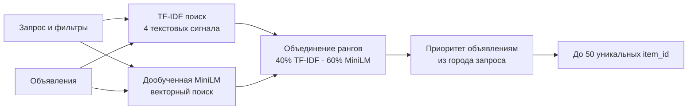

<div align="center">

# Поиск объявлений услуг для Авито

**Тестовое задание на кандидатогенерацию · Data Science Bootcamp**

По короткому запросу выбираем до 50 объявлений, которые стоит передать следующему этапу поиска.

<br>

| Результат на Stepik | Локальная проверка | Финальный метод |
|:---:|:---:|:---|
| **Recall@50 — 0.754007** | **Recall@50 — 0.7845** | TF-IDF + дообученная MiniLM |

</div>

## Содержание

- [Задача](#задача)
- [Как работает решение](#как-работает-решение)
- [Данные и признаки](#данные-и-признаки)
- [Результаты экспериментов](#результаты-экспериментов)
- [Проверка качества и ограничения](#проверка-качества-и-ограничения)
- [Как повторить отправленный ответ](#как-повторить-отправленный-ответ)
- [Как обучить новую MiniLM](#как-обучить-новую-minilm)
- [Структура проекта](#структура-проекта)

## Задача

Пользователь вводит короткий запрос — например, «автоподбор» или «монтаж видеодомофона». В корпусе много объявлений, но на следующий этап поиска можно передать только 50.

Это этап **кандидатогенерации**. Его цель — не идеально расставить объявления по порядку, а не потерять подходящие. Если объявление не попало в эти 50, следующий этап уже не сможет его показать.

Основная метрика — **Recall@50**:

```text
Recall@50 = число подходящих объявлений в топ-50
            / общее число подходящих объявлений
```

Итоговый Recall усредняется по запросам. Порядок объявлений внутри пятидесяти на метрику не влияет.

## Как работает решение

Для каждого запроса я ищу объявления двумя способами. TF-IDF находит совпадения слов и их частей в разных текстовых полях. Дообученная MiniLM ищет объявления со схожим смыслом. Затем результаты объединяются, объявления из нужного города получают приоритет, и формируется список до 50 уникальных `item_id`.



### Почему комбинируются два способа

- **TF-IDF** полезен, когда запрос и заголовок объявления содержат одинаковые слова или близкие словоформы.
- **MiniLM** помогает, когда формулировки отличаются, но смысл похож.
- В локальной проверке их комбинация дала лучший Recall@50 среди проверенных вариантов.

В TF-IDF используются четыре сигнала: совпадение с заголовком, символьные фрагменты заголовка, полный текст объявления и параметры услуги. Ранги двух систем объединяются с весами **40% для TF-IDF и 60% для MiniLM**. В выдаче сначала рассматриваются объявления из локации запроса; если их недостаточно, список дополняется другими кандидатами.

### Модель MiniLM

Используется `sentence-transformers/paraphrase-multilingual-MiniLM-L12-v2`, дообученная на парах «поисковый запрос — выбранное объявление». При поиске запрос и тексты объявлений кодируются в векторы, после чего кандидаты находятся по близости векторов.

Точные обученные веса лежат в `models/minilm_seed17` и хранятся через Git LFS. Скрипт воспроизведения использует эти веса, а не загружает потенциально изменившуюся версию исходной модели.

## Данные и признаки

В репозитории **нет исходных файлов Авито**. Их нужно скачать самостоятельно; инструкция есть ниже.

| Файл | Для чего нужен |
|---|---|
| `train.parquet` | Пары запросов и объявлений, которые выбрали пользователи; используется для настройки и локальной оценки |
| `benchmark_queries.parquet` | Запросы, для которых строится итоговый ответ |
| `benchmark_items.parquet` | Корпус объявлений для поиска |

В отправленном поиске используются:

- запрос и текстовые фильтры;
- заголовок, параметры услуги и описание объявления;
- локация запроса и объявления.

Рейтинг и количество отзывов применялись только в отдельном эксперименте с CatBoost. В отправленный вариант они не входят.

## Результаты экспериментов

Эксперименты проводились на размеченных локальных данных. Размер проверочной выборки и `seed` указаны в таблице: результаты на разных выборках напрямую сравнивать нельзя.

| Вариант | Проверка | Recall@50 |
|---|---|---:|
| TF-IDF | 600 запросов · seed 42 | 0.7509 |
| TF-IDF + CatBoost | 600 запросов · seed 42 | **0.7659** |
| TF-IDF | 600 запросов · seed 17 | 0.7418 |
| TF-IDF + CatBoost | 600 запросов · seed 17 | **0.7537** |
| TF-IDF | 300 запросов · seed 123 | 0.7006 |
| TF-IDF + CatBoost | 300 запросов · seed 123 | **0.7074** |
| Готовая MiniLM, векторный поиск | 600 запросов · seed 42 | 0.5627 |
| TF-IDF + готовая MiniLM | 600 запросов · seed 42 | 0.7517 |
| Дообученная MiniLM, векторный поиск | 600 запросов · seed 17 | 0.7700 |
| **TF-IDF + дообученная MiniLM, смешанные ранги** | **600 запросов · seed 17** | **0.7845** |
| TF-IDF + MiniLM + CatBoost | 600 запросов · seed 17 | 0.7631 |
| TF-IDF + BM25 + CatBoost | 600 запросов · seed 17 | 0.7388 |
| CatBoostRanker + MiniLM, смешанные ранги | 600 запросов · seed 17 | 0.7806 |
| TF-IDF + MiniLM, RRF | 600 запросов · seed 17 | 0.7742 |
| TF-IDF + MiniLM, отдельные ранги текстовых полей | 600 запросов · seed 17 | 0.7809 |
| TF-IDF + MiniLM, вес выбран на первых 300 запросах | 600 запросов · seed 17 | 0.7819 |
| Похожие прошлые запросы + MiniLM | 600 запросов · seed 17 | 0.7675 |

Для последнего варианта с настройкой веса результат на первых 300 запросах составил **0.8009**, а на следующих 300 — **0.7629**. Поэтому значение 0.8 на первой части не считаю устойчивым улучшением.

Лучший общий локальный результат — **0.7845**. Он получен гибридом TF-IDF и дообученной MiniLM; этот метод использовался для создания `answer.csv`. Подробные заметки о подходах и сравнениях собраны в [EXPERIMENTS.md](EXPERIMENTS.md).

## Проверка качества и ограничения

Для локальной оценки запросы проверки отделялись от данных, на которых обучалась соответствующая модель. Это позволяет сравнивать варианты на запросах, не использованных при обучении. При сравнении результатов важно учитывать размер выборки и `seed`.

Что показали эксперименты:

1. Дообученная MiniLM помогла найти больше подходящих объявлений, чем один TF-IDF.
2. Совместное использование TF-IDF и MiniLM дало лучший проверенный Recall@50 — **0.7845**.
3. CatBoost улучшал TF-IDF в нескольких локальных проверках, но добавление CatBoost к сильному сочетанию TF-IDF и MiniLM не улучшило итог.
4. BM25 в проверенном варианте с CatBoost снизил метрику, поэтому в отправленный метод не включён.

Есть и ограничения:

- В логах обучения присутствуют выбранные объявления, но отсутствие объявления в логах не означает, что оно точно нерелевантно. Это ограничение данных для обучения.
- Итоговый Recall на закрытом benchmark неизвестен: разметка там скрыта.
- Локальное значение 0.7845 зависит от конкретной проверочной выборки; для разных `seed` получались разные результаты.
- На этапе локальной проверки для большого пула кандидатов полнота выросла с 0.8614 у TF-IDF до 0.8981 у TF-IDF + MiniLM. Это отдельное измерение полноты пула, а не Recall@50.
- Веса MiniLM и входные данные хэшируются при воспроизведении. Точное совпадение результата проверялось на Mac с MPS; на CPU или CUDA вычисления могут дать небольшие отличия.

В итоговом CSV проверяются количество запросов, формат и наличие идентификаторов, отсутствие повторов и лимит в 50 объявлений.

## Как повторить отправленный ответ

### 1. Скачай данные

Скачай [архив с данными Авито](https://disk.yandex.ru/d/sNhfo0YOjGtufg) и размести три parquet-файла в папке `data`:

```text
data/
├── train.parquet
├── benchmark_queries.parquet
└── benchmark_items.parquet
```

### 2. Установи Git LFS и склонируй репозиторий

```bash
git lfs install
git clone https://github.com/dud0k3/avito-services-candidate-retrieval.git
cd avito-services-candidate-retrieval
```

### 3. Установи зависимости и воспроизведи ответ

```bash
python3 -m pip install -r requirements-reproducible.txt
python3 reproduce_answer.py --data-dir ./data --device mps
```

Для NVIDIA GPU укажи `--device cuda`; для процессора — `--device cpu`.

Скрипт проверяет SHA-256 файлов данных и модели, создаёт `answer.csv` и сравнивает его с сохранённым файлом. Для отправленного `answer.csv` ожидается SHA-256:

```text
7b73162eb481f3e7389ce737d4e77725e711b808f1fcdcd53dd083a32549021b
```

Точное побайтовое совпадение было проверено на Mac с MPS. На другом устройстве итог может отличаться из-за вычислений на CPU/GPU.

## Как обучить новую MiniLM

Этот путь нужен, если хочется заново обучить модель. Он **не предназначен для побайтового повтора** уже отправленного `answer.csv`: новое обучение может немного изменить веса и предсказания.

```bash
python3 -m pip install -r requirements.txt -r requirements-transformers.txt
python3 finetune_minilm.py --data-dir ./data \
  --model-dir sentence-transformers/paraphrase-multilingual-MiniLM-L12-v2 \
  --output-dir ./artifacts/minilm-seed17 --max-pairs 20000 \
  --epochs 2 --batch-size 32 --seed 17
python3 predict_minilm_blend.py --data-dir ./data \
  --model-dir ./artifacts/minilm-seed17 --output ./answer.csv --device mps
```

При первом запуске исходная модель и пакеты скачиваются из открытых источников. После этого обработка данных выполняется локально, без внешних API.

## Структура проекта

| Файл | Назначение |
|---|---|
| `answer.csv` | Итоговый ответ, который был отправлен на платформу |
| `reproduce_answer.py` | Повторяет и проверяет отправленный ответ |
| `predict_minilm_blend.py` | Строит предсказания TF-IDF + MiniLM |
| `finetune_minilm.py` | Дообучает MiniLM на парах запросов и объявлений |
| `retrieval.py` | Поиск кандидатов и работа с TF-IDF признаками |
| `validate_minilm_catboost.py` | Локальная проверка варианта MiniLM + CatBoost |
| `validate_rerank.py` | Локальная проверка CatBoost reranker |
| `rerank.py` | Создаёт отдельный ответ с сохранённой моделью CatBoost |
| `reranker.cbm` | Сохранённая модель CatBoost для отдельного эксперимента |
| `models/minilm_seed17/` | Дообученные веса MiniLM для воспроизведения |
| `EXPERIMENTS.md` | Подробные результаты и заметки по экспериментам |

---

<div align="center">

**Автор: [dud0k3](https://github.com/dud0k3)**  ·  [Репозиторий](https://github.com/dud0k3/avito-services-candidate-retrieval)

</div>
